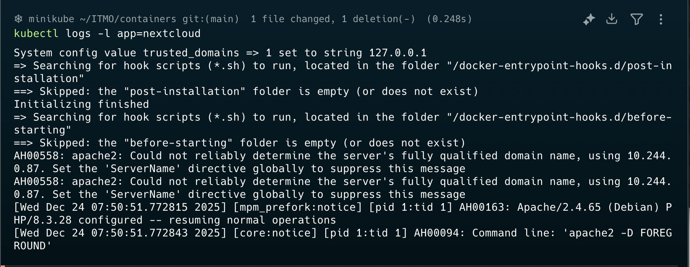
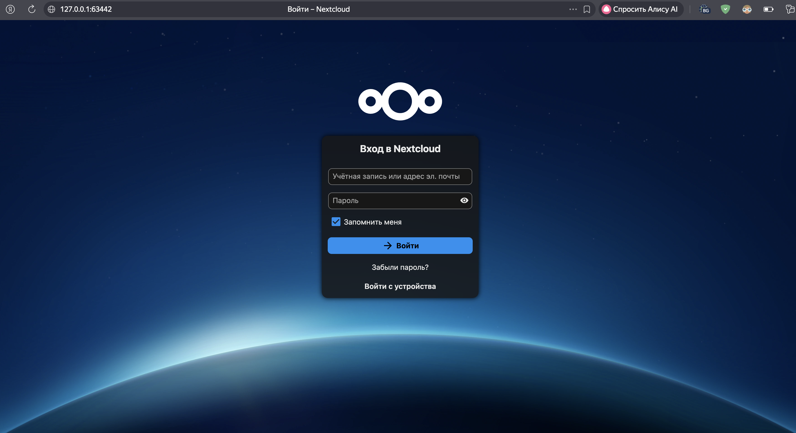
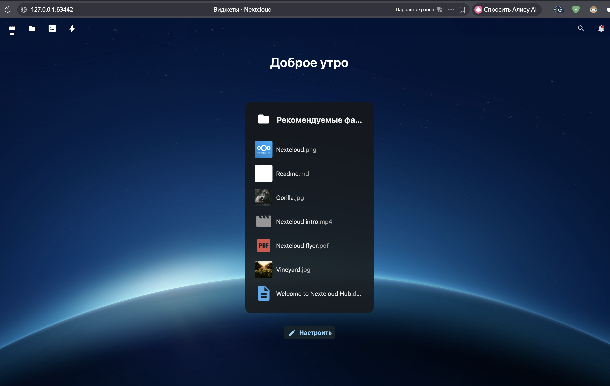
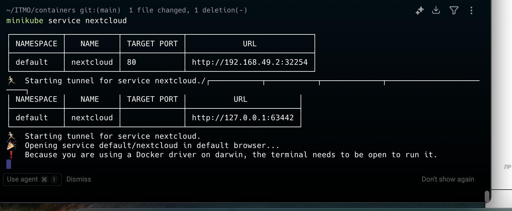

# Лабораторная работа 3: Kubernetes

## Описание

Развертывание тестового сервиса Nextcloud с базой данных PostgreSQL в Kubernetes кластере (minikube).

## Структура проекта

### Манифесты PostgreSQL

- `pg_configmap.yml` - ConfigMap с настройками базы данных
- `pg_secret.yml` - Secret с учетными данными
- `pg_service.yml` - Service для доступа к PostgreSQL
- `pg_deployment.yml` - Deployment для PostgreSQL
- `pg-init-configmap.yml` - ConfigMap с init-скриптом для инициализации БД

### Манифесты Nextcloud

- `nextcloud-configmap.yml` - ConfigMap с переменными окружения
- `nextcloud.yml` - Secret и Deployment с настроенными пробами
- `nextcloud_service.yml` - Service для доступа к Nextcloud

## Ход работы

### Установка minikube

Установлен и запущен minikube, проверена конфигурация кластера.

### Развертывание PostgreSQL

Созданы ресурсы в следующем порядке:
```bash
kubectl create -f pg_configmap.yml
kubectl create -f pg_secret.yml
kubectl create -f pg_service.yml
kubectl create -f pg_deployment.yml
```

### Развертывание Nextcloud

Созданы ресурсы:
```bash
kubectl create -f nextcloud-configmap.yml
kubectl create -f nextcloud.yml
kubectl create -f nextcloud_service.yml
```

Проверены логи установки Nextcloud:



### Доступ к сервису

Запущен туннель для доступа к Nextcloud:
```bash
minikube service nextcloud-service
```

Открыт веб-интерфейс и выполнен вход:





Проверено состояние сервисов и открытых портов:



## Ответы на вопросы

### Вопрос 1: Важен ли порядок выполнения манифестов? Почему?

Порядок важен для зависимых ресурсов. ConfigMap и Secret должны быть созданы до Deployment, который на них ссылается, иначе Deployment не сможет запустить поды из-за отсутствующих переменных окружения. Service может быть создан в любом порядке относительно Deployment.

Рекомендуемый порядок: ConfigMap → Secret → Service → Deployment

### Вопрос 2: Что произойдет, если отскейлить количество реплик postgres-deployment в 0, затем обратно в 1?

При масштабировании до 0 реплик под PostgreSQL будет удален, база данных станет недоступна, Nextcloud потеряет соединение с БД.

При масштабировании обратно до 1 реплики будет создан новый под PostgreSQL. Если не используется persistent volume, PostgreSQL создаст новую пустую базу данных, и все данные будут потеряны.

При попытке зайти в Nextcloud он попытается подключиться к новой БД. Так как БД пустая, Nextcloud может попытаться выполнить установку заново или выдать ошибку подключения.

## Команды для развертывания

Полное развертывание всех ресурсов:

```bash
# PostgreSQL
kubectl apply -f pg-init-configmap.yml
kubectl apply -f pg_configmap.yml
kubectl apply -f pg_secret.yml
kubectl apply -f pg_service.yml
kubectl apply -f pg_deployment.yml

# Nextcloud
kubectl apply -f nextcloud-configmap.yml
kubectl apply -f nextcloud.yml
kubectl apply -f nextcloud_service.yml
```

Проверка состояния:

```bash
kubectl get pods
kubectl get services
kubectl get configmap
kubectl get secret
```

Доступ к Nextcloud:

```bash
minikube service nextcloud-service
```

