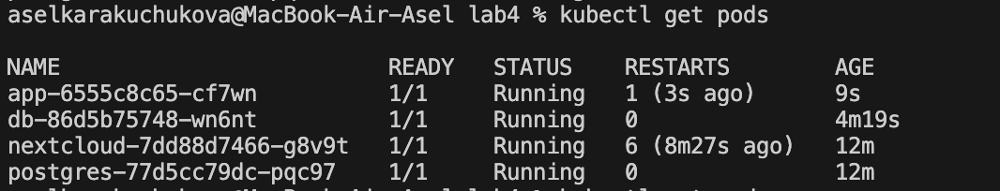
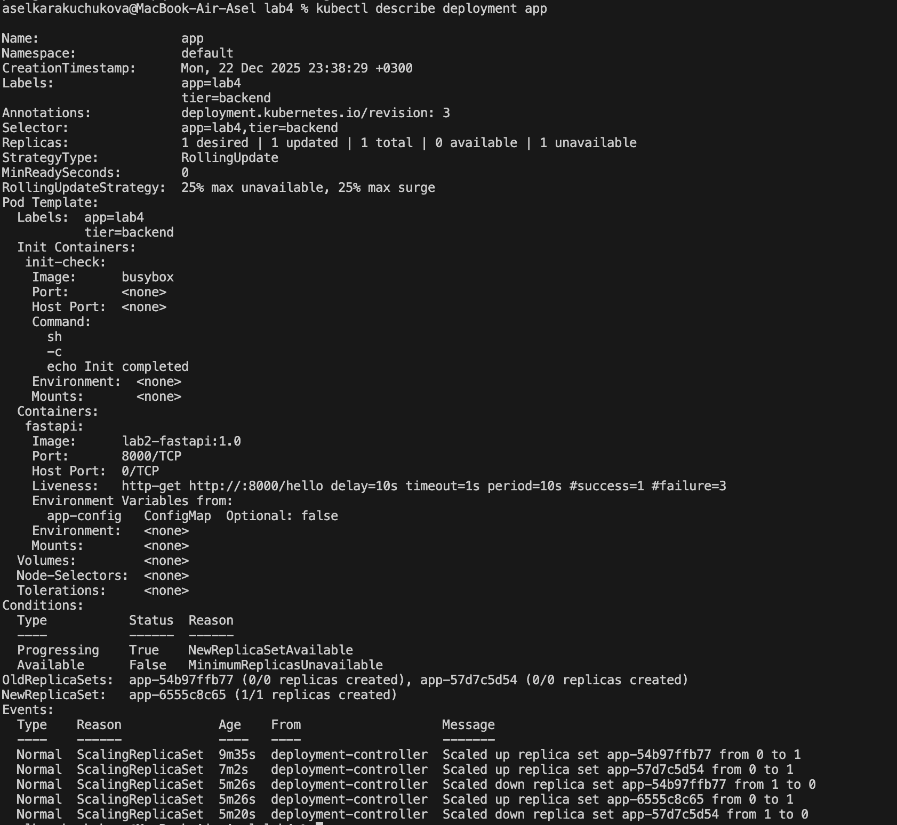
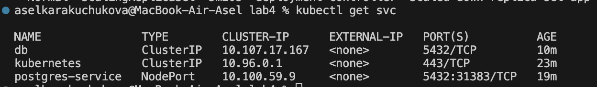

# ЛР 4. More Kubernetes

## Цель работы
Развернуть собственный сервис в Kubernetes в виде связки из нескольких контейнеров
с использованием init-container, по аналогии с Docker Compose из ЛР 2.

---

## Архитектура решения
В рамках лабораторной работы развернут следующий стек:

- PostgreSQL (база данных)
- FastAPI-приложение (собственный сервис)
- init-container для предварительной инициализации

Сервисы взаимодействуют внутри Kubernetes-кластера.

---

## Используемые Kubernetes-ресурсы
В работе использованы следующие сущности Kubernetes:

- Deployment — для PostgreSQL и FastAPI
- Service — для доступа приложения к базе данных
- ConfigMap — конфигурация приложения
- Secret — учетные данные базы данных
- initContainer — предварительная инициализация сервиса
- volume — для хранения данных PostgreSQL
- livenessProbe — проверка работоспособности приложения
- labels — для логической группировки ресурсов

---

## Кастомный Docker-образ
FastAPI-приложение собрано в кастомный Docker-образ из собственного Dockerfile
(используется образ `lab2-fastapi:1.0`), который применяется в Kubernetes Deployment.

---

## Проверка работы
После применения манифестов сервисы были успешно развернуты в Kubernetes.


*Скриншот 1 — Состояние pod'ов Kubernetes*

```bash
kubectl get pods
```




*Скриншот 2 — Deployment FastAPI с init-container и кастомным образом*

```bash
kubectl describe deployment app
```




*Скриншот 3 — Service для взаимодействия сервисов*

```bash
kubectl get svc
```

